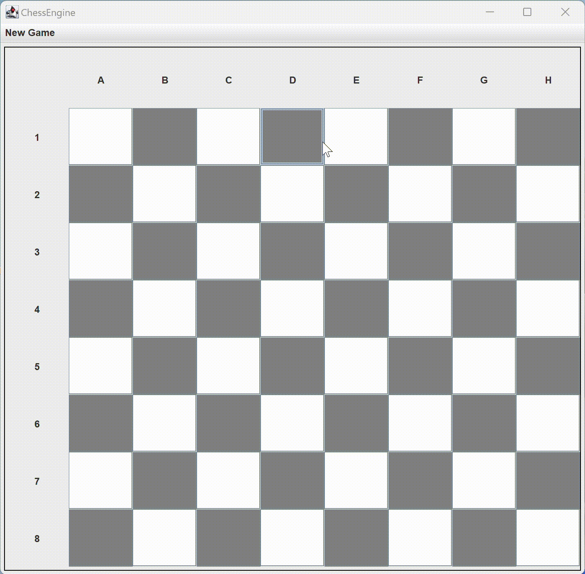

## Java-Chess-Engine
A chess game build by Java Swing lib

### Functionality
* pawn-race: Player can choose which column should be the gap or randomly chosen by the program.
* standard game: Player vs Player; the standard game rule (I hope the rule is "standard" because idk how to play chess
* play with AI: implemented by minimax alpha beta pruning algorithm

### AI Player
* There are three difficulties: easy, medium, and hard, corresponding to 1,2,4 depths of search of the algorithm (easy is dubious AI)
* AI player is BLACK by default

## Small Tips
* WHITE side first in any mode
* close side frame after choosing specific gap or renew the game after winning.

### Further Implementation
* Optimization: run time
* Frame layout
* more functionalities...
